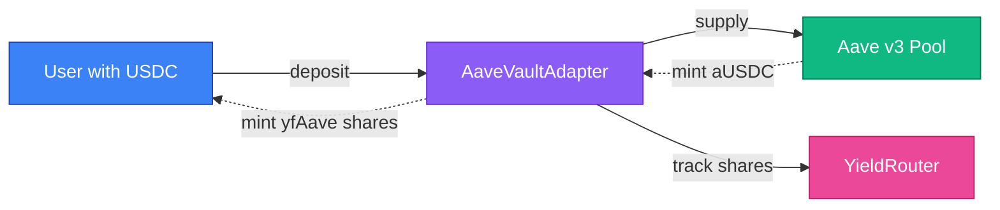
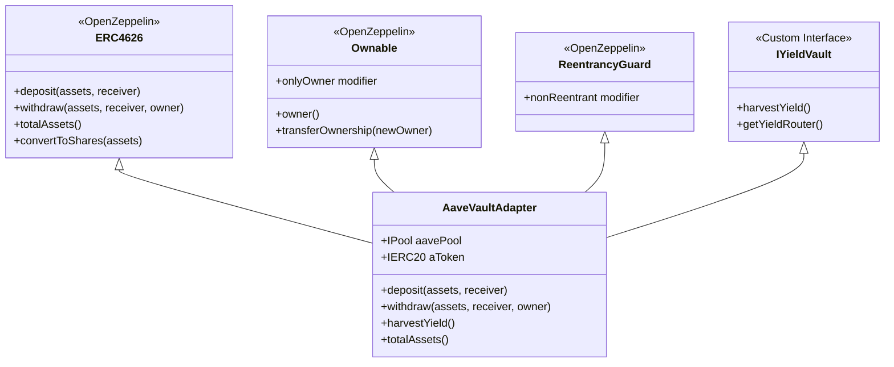
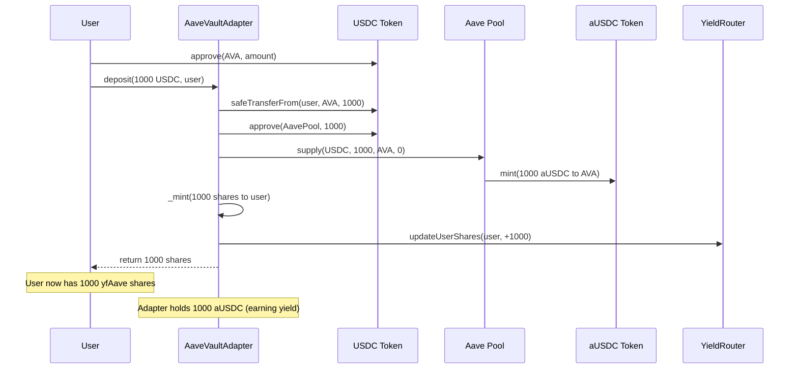
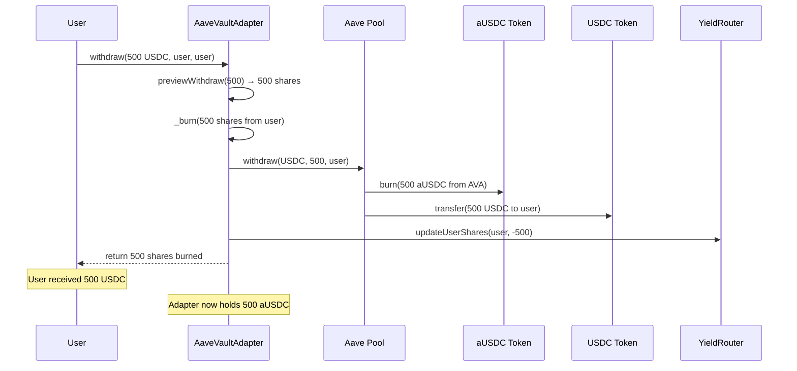
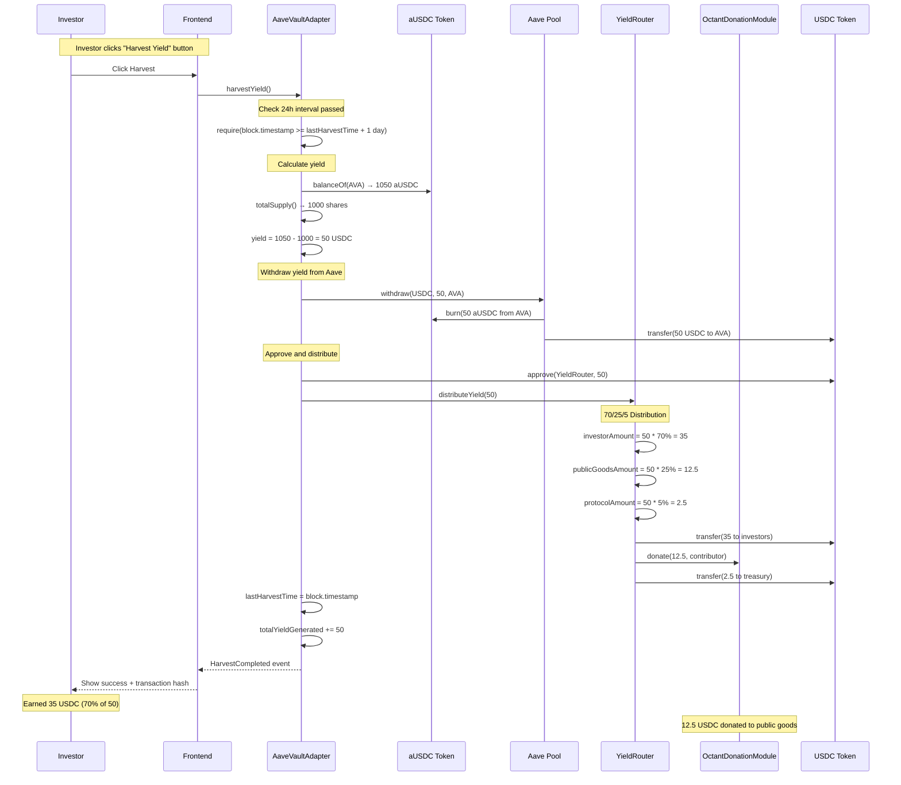

# Aave v3 Integration

This document provides comprehensive technical documentation of Aruna's Aave v3 integration, covering implementation details, interfaces, accounting mechanisms, and security measures.

## Overview

The `AaveVaultAdapter` is an ERC-4626 compliant vault that wraps Aave v3 lending pools, enabling users to deposit stablecoins and earn yield. The adapter manages all interactions with Aave's IPool interface and handles automatic yield harvesting for distribution.

**File:** `src/vaults/AaveVaultAdapter.sol`

## Architecture

### Design Pattern

The adapter follows the ERC-4626 tokenized vault standard, providing a normalized interface for Aave v3 deposits:



### Contract Hierarchy



**Inheritance Benefits:**
- **ERC4626**: Standard vault interface from OpenZeppelin
- **Ownable**: Access control for admin functions
- **ReentrancyGuard**: Protection against reentrancy attacks
- **IYieldVault**: Custom interface for yield operations

## Interfaces

### IPool (Aave v3 Core)

The primary interface for interacting with Aave v3:

```solidity
interface IPool {
    /**
     * @notice Supplies assets to the Aave protocol
     * @param asset Address of the underlying asset
     * @param amount Amount to supply
     * @param onBehalfOf Address that receives the aTokens
     * @param referralCode Referral program code (we use 0)
     */
    function supply(
        address asset,
        uint256 amount,
        address onBehalfOf,
        uint16 referralCode
    ) external;

    /**
     * @notice Withdraws assets from the Aave protocol
     * @param asset Address of the underlying asset
     * @param amount Amount to withdraw
     * @param to Address that receives the underlying
     * @return Actual amount withdrawn
     */
    function withdraw(
        address asset,
        uint256 amount,
        address to
    ) external returns (uint256);
}
```

**Implementation Details:**
- `supply()` is called during deposits to move assets into Aave
- `withdraw()` is called during withdrawals and yield harvesting
- Referral code is always set to 0 (no referral program)

### aToken Interface

aTokens are Aave's interest-bearing tokens that represent supplied assets:

```solidity
// aTokens implement standard ERC20
interface IERC20 {
    function balanceOf(address account) external view returns (uint256);
}
```

**Key Characteristics:**
- aToken balance increases automatically as interest accrues
- Balance represents principal + accumulated interest
- 1:1 redeemable for underlying asset at any time
- No explicit claim function needed

### ERC-4626 Standard

Full implementation of the vault standard:

```solidity
interface IERC4626 {
    // Deposit/Withdrawal
    function deposit(uint256 assets, address receiver) external returns (uint256 shares);
    function mint(uint256 shares, address receiver) external returns (uint256 assets);
    function withdraw(uint256 assets, address receiver, address owner) external returns (uint256 shares);
    function redeem(uint256 shares, address receiver, address owner) external returns (uint256 assets);

    // Accounting
    function totalAssets() external view returns (uint256);
    function convertToShares(uint256 assets) external view returns (uint256);
    function convertToAssets(uint256 shares) external view returns (uint256);

    // Limits
    function maxDeposit(address receiver) external view returns (uint256);
    function maxWithdraw(address owner) external view returns (uint256);

    // Preview
    function previewDeposit(uint256 assets) external view returns (uint256);
    function previewWithdraw(uint256 assets) external view returns (uint256);
}
```

## Accounting Mechanisms

### Share Calculation

The adapter maintains a 1:1 ratio between shares and initial deposits:

```solidity
// First deposit
shares = assets

// Subsequent deposits (after yield accrual)
shares = (assets * totalSupply()) / totalAssets()
```

**Rationale:**
- Simplifies accounting and user understanding
- Prevents share dilution attacks
- Yield is distributed separately via YieldRouter
- Fair for all depositors regardless of entry time

### Yield Tracking

Yield is calculated as the difference between current aToken balance and expected balance:

```solidity
uint256 currentBalance = aToken.balanceOf(address(this));  // Includes accrued interest
uint256 expectedBalance = totalSupply();                    // Shares minted to users
uint256 yieldGenerated = currentBalance - expectedBalance;
```

**Example Scenario:**

Initial state:
- User deposits: 1,000 USDC
- aToken balance: 1,000
- Shares minted: 1,000

After 30 days at 6.5% APY:
- aToken balance: 1,005.42 USDC
- Shares outstanding: 1,000
- Yield generated: 5.42 USDC

### Asset Flow

**Deposit Process:**



**Withdrawal Process:**



**Yield Harvest Process:**



**⚠️ Important**: Yield must be manually harvested via the "Harvest Yield" button in the investor dashboard. Public goods donations only occur AFTER harvest is triggered.

## Safety Checks

### 1. Reentrancy Protection

All external state-changing functions use the `nonReentrant` modifier:

```solidity
function deposit(uint256 assets, address receiver)
    public
    override
    nonReentrant
    returns (uint256)
{
    // Function body
}
```

This prevents:
- Recursive calls during token transfers
- Cross-function reentrancy attacks
- External call manipulation

### 2. Input Validation

Comprehensive validation on all inputs:

```solidity
if (assets == 0) revert InvalidAmount();
if (receiver == address(0)) revert InvalidAddress();
if (isPaused) revert ContractPaused();
```

Checks include:
- Non-zero amounts for deposits and withdrawals
- Valid non-zero addresses in constructor
- Contract pause state
- Sufficient balance (implicit in SafeERC20)

### 3. Safe Token Operations

All token transfers use OpenZeppelin's SafeERC20:

```solidity
using SafeERC20 for IERC20;

IERC20(asset()).safeTransferFrom(msg.sender, address(this), assets);
IERC20(asset()).safeTransfer(receiver, assets);
```

Benefits:
- Handles non-standard ERC20 implementations
- Reverts on failed transfers (no silent failures)
- Protects against return value manipulation
- Compatible with tokens that don't return boolean

### 4. Approval Management

Optimized approval pattern:

```solidity
// One-time approval in constructor
IERC20(_asset).forceApprove(_aavePool, type(uint256).max);

// Per-harvest approval to YieldRouter
IERC20(asset()).forceApprove(address(yieldRouter), yieldGenerated);
```

Security measures:
- `forceApprove` safely handles existing approvals
- Infinite approval only to trusted Aave Pool
- Per-transaction approval to YieldRouter for exact amounts
- No approvals to user addresses

### 5. Harvest Timing Control

Rate limiting on yield harvesting:

```solidity
uint256 public constant HARVEST_INTERVAL = 1 days;

function harvestYield() external override {
    if (block.timestamp < lastHarvestTime + HARVEST_INTERVAL) {
        revert HarvestTooSoon();
    }
    _harvestYield();
}
```

Prevents:
- Harvest spamming and gas griefing
- Frequent small harvests that waste gas
- Accounting manipulation via rapid harvests

### 6. Share Calculation Protection

Uses ERC-4626 preview functions for accurate calculations:

```solidity
shares = previewDeposit(assets);
assets = previewWithdraw(shares);
```

These functions:
- Use `totalAssets() / totalSupply()` for exchange rate
- Account for current yield in calculations
- Prevent share inflation attacks
- Protect against rounding exploits
- Mitigate first depositor attacks

### 7. Emergency Controls

Owner-only safety mechanisms:

```solidity
function togglePause() external onlyOwner {
    isPaused = !isPaused;
    emit PauseToggled(isPaused);
}

function emergencyWithdraw(address token, uint256 amount) external onlyOwner {
    IERC20(token).safeTransfer(owner(), amount);
}
```

Use cases:
- Pause deposits during detected vulnerabilities
- Circuit breaker for suspicious activity
- Recovery of accidentally sent tokens
- Emergency fund retrieval

### 8. Allowance Validation

Proper allowance checking in withdrawal functions:

```solidity
if (msg.sender != owner) {
    _spendAllowance(owner, msg.sender, shares);
}
```

This ensures:
- Only owner or approved addresses can withdraw
- Follows ERC-4626 standard allowance pattern
- Prevents unauthorized fund access
- Supports delegation via approve/transfer pattern

## Gas Optimization

### Immutable Variables

State variables that never change are marked immutable:

```solidity
IPool public immutable aavePool;
IERC20 public immutable aToken;
```

Gas savings: ~2,100 gas per read operation after deployment

### Calculation Caching

Local variables cache expensive operations:

```solidity
uint256 currentBalance = totalAssets();
uint256 expectedBalance = totalSupply();
uint256 yieldGenerated = currentBalance - expectedBalance;
```

Avoids multiple calls to the same view functions.

### Batch Operations

Harvest interval enforces batching:

```solidity
if (block.timestamp >= lastHarvestTime + HARVEST_INTERVAL) {
    _harvestYield();
}
```

This batches yield into daily distributions rather than per-transaction.

## Contract Addresses

### Base Sepolia Testnet

**⚠️ IMPORTANT: Correct Addresses for Base Sepolia**

```
USDC: 0x036CbD53842c5426634e7929541eC2318f3dCF7e
Aave v3 Pool: 0x07eA79F68B2B3df564D0A34F8e19D9B1e339814b
Aave aUSDC: 0x4e65fE4DbA92790696d040ac24Aa414708F5c0AB
```

**Note:** These are the officially verified Aave v3 addresses on Base Sepolia used in the deployment script.

### Deployed Aruna Contracts

After deployment, addresses are saved to:
```
Aruna-Contract/deployments/84532.json
```

**Current Deployment (Nov 2024):**
- AaveVaultAdapter: `0xCE62F26dCAc5Cfc9C1ac03888Dc6D4D1e2e47905`
- View on BaseScan: https://sepolia.basescan.org/address/0xCE62F26dCAc5Cfc9C1ac03888Dc6D4D1e2e47905

## Testing

### Unit Test Coverage

Recommended test scenarios:

```solidity
// Basic operations
testDeposit() - Verify shares minted correctly
testWithdraw() - Verify assets returned correctly
testRedeem() - Verify share burning works
testMultipleUsers() - Test with multiple depositors

// Yield mechanics
testYieldAccrual() - Verify aToken balance increases
testHarvest() - Verify yield extraction works
testYieldDistribution() - Verify 70/25/5 split

// Edge cases
testZeroDeposit() - Should revert
testDepositWhilePaused() - Should revert
testUnauthorizedWithdraw() - Should revert
testHarvestTooSoon() - Should revert

// Integration
testFullUserFlow() - Deposit → Time → Harvest → Withdraw
testAavePoolIntegration() - Verify Aave calls work correctly
```

### Integration Testing

Test with actual Aave contracts on Base Sepolia:

```bash
forge test --fork-url https://sepolia.base.org --match-contract AaveVaultAdapterTest -vvv
```

## Deployment

### Prerequisites

1. Base Sepolia ETH for gas
2. Configured environment variables
3. Verified Aave contract addresses

### Deployment Command

```bash
forge script script/DeployAruna.s.sol \
  --rpc-url https://sepolia.base.org \
  --broadcast \
  --verify \
  --etherscan-api-key $BASESCAN_API_KEY
```

### Post-Deployment Verification

Verify the integration:

```bash
# Check aToken address
cast call <AAVE_VAULT_ADAPTER> "aToken()" --rpc-url https://sepolia.base.org

# Check Aave Pool address
cast call <AAVE_VAULT_ADAPTER> "aavePool()" --rpc-url https://sepolia.base.org

# Check asset
cast call <AAVE_VAULT_ADAPTER> "asset()" --rpc-url https://sepolia.base.org
```

## Frontend Integration

### Using Harvest Functionality

Investors trigger yield harvesting from the investor dashboard using the `useHarvestAaveYield()` hook:

```typescript
import { useHarvestAaveYield } from "@/hooks/useContracts"

const { harvest, isPending, isConfirming, isSuccess, hash, error } = useHarvestAaveYield()

// Trigger harvest
const handleHarvest = () => {
  harvest() // Calls harvestYield() on AaveVaultAdapter
}

// Transaction states:
// - isPending: Waiting for user wallet confirmation
// - isConfirming: Transaction submitted, waiting for confirmation
// - isSuccess: Harvest complete, yield distributed
// - hash: Transaction hash for BaseScan verification
```

**Harvest Requirements:**
- Minimum 24-hour interval between harvests per vault
- Anyone can call harvest (permissionless)
- Transaction automatically triggers 70/25/5 distribution
- Public goods donations created immediately upon harvest

### Transaction Flow

The frontend displays a multi-step transaction modal:
1. **Confirming** - User confirms transaction in wallet
2. **Pending** - Transaction submitted to blockchain
3. **Success** - Yield distributed, shows transaction hash

Users can verify the harvest transaction on BaseScan to see:
- Yield amount withdrawn from Aave
- Distribution to YieldRouter
- Allocation to investors, public goods, and protocol

## Performance Metrics

Gas costs (estimated):

| Operation | Gas Used | Notes |
|-----------|----------|-------|
| First Deposit | ~200,000 | Includes Aave supply call |
| Subsequent Deposit | ~150,000 | Optimized path |
| Withdraw | ~150,000 | Includes Aave withdraw |
| Redeem | ~150,000 | Similar to withdraw |
| Harvest Yield | ~180,000 | Includes distribution |

## References

- Aave v3 Documentation: https://docs.aave.com/developers/
- ERC-4626 Standard: https://eips.ethereum.org/EIPS/eip-4626
- OpenZeppelin ERC4626: https://docs.openzeppelin.com/contracts/4.x/erc4626
- Implementation: `src/vaults/AaveVaultAdapter.sol`
