# Octant Public Goods Integration

This document details Aruna's integration with Octant v2 for automatic public goods funding, including the distribution mechanism, tracking systems, and implementation details.

## Overview

Aruna automatically allocates 25% of all generated yield to public goods projects through Octant v2. This creates a sustainable funding mechanism where every dollar of yield generates $0.25 for the Ethereum ecosystem.

**File:** `src/modules/OctantDonationModule.sol`

## The 70/25/5 Distribution Model

### Allocation Breakdown

Every dollar of yield is distributed according to a fixed formula:


This split is hardcoded as constants and cannot be changed:

```solidity
uint256 public constant INVESTOR_PERCENTAGE = 7000;     // 70%
uint256 public constant PUBLIC_GOODS_PERCENTAGE = 2500; // 25%
uint256 public constant PROTOCOL_FEE_PERCENTAGE = 500;  // 5%
uint256 public constant BASIS_POINTS = 10000;
```

### Visual Impact at Scale

```mermaid
graph TB
    subgraph TVL Scenario["$10M TVL @ 7.8% APY"]
        TOTAL[Total Annual Yield<br/>$780,000]
    end

    TOTAL --> INV[Investors Earn<br/>$546,000<br/>5.46% effective APY]
    TOTAL --> PG[Public Goods Receive<br/>$195,000/year<br/>sustainable funding]
    TOTAL --> PROTO[Protocol Sustainability<br/>$39,000/year<br/>maintenance & ops]

    PG --> PROJECTS[Funds distributed to:<br/>• Ethereum Foundation<br/>• Protocol Guild<br/>• Gitcoin<br/>• OpenZeppelin<br/>• And more via Octant]

    classDef tvlClass fill:#F59E0B,stroke:#D97706,color:#fff
    classDef investorClass fill:#3B82F6,stroke:#1E40AF,color:#fff
    classDef pgClass fill:#10B981,stroke:#047857,color:#fff
    classDef protocolClass fill:#EC4899,stroke:#BE185D,color:#fff

    class TOTAL tvlClass
    class INV investorClass
    class PG,PROJECTS pgClass
    class PROTO protocolClass
```



### Why 25%?

The 25% allocation balances three objectives:

1. **Investor Competitiveness:** 70% maintains attractive returns (5.46% effective vs 7.8% gross)
2. **Meaningful Impact:** 25% generates substantial public goods funding at scale
3. **Protocol Sustainability:** 5% ensures long-term protocol maintenance

Example at $10M TVL with 7.8% APY:
- Total yield: $780,000
- Investors: $546,000
- Public goods: $195,000
- Protocol: $39,000

## Architecture

### Complete Donation Flow

```mermaid
sequenceDiagram
    participant I as Investor
    participant UI as Frontend
    participant V as Vault<br/>(Aave/Morpho)
    participant YR as YieldRouter
    participant ODM as OctantDonationModule
    participant USDC as USDC Token
    participant OD as Octant Deposits
    participant OCTANT as Octant v2

    Note over V: Yield accumulates automatically<br/>in Aave/Morpho protocols

    Note over I,UI: Step 1: Investor Triggers Harvest
    I->>UI: Click "Harvest Yield" button
    UI->>V: harvestYield()
    Note over V: Check 24h interval passed

    V->>V: Calculate yield (50 USDC)
    V->>YR: distributeYield(50 USDC)

    Note over YR: Step 2: Calculate 70/25/5 Split
    YR->>YR: investorAmount = 50 * 70% = 35 USDC
    YR->>YR: publicGoodsAmount = 50 * 25% = 12.5 USDC
    YR->>YR: protocolAmount = 50 * 5% = 2.5 USDC

    Note over YR,ODM: Step 3: Distribute to Recipients
    YR->>USDC: transfer(35 to investors)
    YR->>USDC: transfer(2.5 to treasury)
    YR->>USDC: approve(ODM, 12.5)
    YR->>ODM: donate(12.5, business_address)

    Note over ODM: Step 4: Track Donation
    ODM->>USDC: safeTransferFrom(YR, ODM, 12.5)
    ODM->>ODM: totalDonated += 12.5
    ODM->>ODM: currentEpochDonations += 12.5
    ODM->>ODM: businessContributions[business] += 12.5
    ODM->>OD: getCurrentEpoch() → epoch 42
    ODM->>ODM: donationsPerEpoch[42] += 12.5
    ODM->>ODM: emit DonationMade(42, 12.5, business)

    Note over ODM: Donations accumulate throughout epoch

    Note over ODM,OCTANT: Step 5: Forward to Octant (periodic)
    Note over ODM: Owner calls forwardToOctant()<br/>once per epoch
    ODM->>USDC: approve(OctantDeposits, currentEpochDonations)
    ODM->>OD: lock(currentEpochDonations)
    OD->>USDC: transferFrom(ODM, OD, amount)
    OD->>OCTANT: Queue for epoch distribution
    ODM->>ODM: currentEpochDonations = 0
    ODM->>ODM: emit EpochFinalized(42, amount)

    Note over OCTANT: Step 6: Octant Distributes
    OCTANT->>OCTANT: Distribute to approved projects:<br/>• Ethereum Foundation<br/>• Protocol Guild<br/>• Gitcoin, etc.
```



### Tracking Architecture


**⚠️ Critical Note**: Public goods donations do NOT happen automatically. Investors must actively click the "Harvest Yield" button in the investor dashboard to trigger the distribution. This is by design to optimize gas costs and batch distributions.

### Key Components

**YieldRouter:**
- Calculates distribution percentages
- Executes transfers
- Calls OctantDonationModule

**OctantDonationModule:**
- Receives public goods allocation
- Tracks contributions
- Manages Octant interaction

**IOctantDeposits:**
- Interface to Octant v2
- Handles epoch-based donations

## Implementation Details

### OctantDonationModule Contract

```solidity
contract OctantDonationModule is Ownable, ReentrancyGuard {
    using SafeERC20 for IERC20;

    // Octant integration
    IOctantDeposits public octantDeposits;
    IERC20 public donationToken;

    // Constants
    uint256 public constant PUBLIC_GOODS_PERCENTAGE = 2500;
    uint256 public constant BASIS_POINTS = 10000;

    // Tracking
    uint256 public totalDonated;
    uint256 public currentEpochDonations;
    mapping(uint256 => uint256) public donationsPerEpoch;
    mapping(address => uint256) public businessContributions;

    // Supported projects
    string[] public supportedProjects;
}
```

### Core Functions

**donate()**

Called by YieldRouter for each yield distribution:

```solidity
function donate(uint256 amount, address contributor) external nonReentrant {
    if (amount == 0) revert InvalidAmount();

    // Transfer from YieldRouter
    donationToken.safeTransferFrom(msg.sender, address(this), amount);

    // Update tracking
    totalDonated += amount;
    currentEpochDonations += amount;
    businessContributions[contributor] += amount;

    // Track by epoch
    uint256 currentEpoch = octantDeposits.getCurrentEpoch();
    donationsPerEpoch[currentEpoch] += amount;

    emit DonationMade(currentEpoch, amount, contributor, block.timestamp);
}
```

**forwardToOctant()**

Batches donations and sends to Octant:

```solidity
function forwardToOctant() external onlyOwner nonReentrant {
    if (currentEpochDonations == 0) revert InvalidAmount();

    uint256 amount = currentEpochDonations;
    uint256 currentEpoch = octantDeposits.getCurrentEpoch();

    // Approve Octant contract
    donationToken.safeIncreaseAllowance(address(octantDeposits), amount);

    // Lock funds for epoch
    try octantDeposits.lock(amount) {
        currentEpochDonations = 0;
        emit EpochFinalized(currentEpoch, amount);
    } catch {
        revert DonationFailed();
    }
}
```

## Tracking and Transparency

### Per-Business Attribution

Every business can see their contribution:

```solidity
mapping(address => uint256) public businessContributions;

function getBusinessContribution(address business)
    external
    view
    returns (uint256)
{
    return businessContributions[business];
}
```

Example:
```
Business A submitted $50,000 invoice
Generated $200 yield over 3 months
Business A's contribution: $50 (25% of $200)
```

### Per-Epoch Tracking

Donations are tracked by Octant epoch:

```solidity
mapping(uint256 => uint256) public donationsPerEpoch;

function getEpochDonations(uint256 epoch)
    external
    view
    returns (uint256)
{
    return donationsPerEpoch[epoch];
}
```

This enables:
- Historical analysis
- Epoch-by-epoch accountability
- Trend identification
- Performance metrics

### Global Statistics

Total donations across all time:

```solidity
uint256 public totalDonated;
```

Current epoch accumulated donations:

```solidity
uint256 public currentEpochDonations;
```

### Event Emissions

All donations emit events for transparency:

```solidity
event DonationMade(
    uint256 indexed epoch,
    uint256 amount,
    address indexed contributor,
    uint256 timestamp
);

event EpochFinalized(
    uint256 indexed epoch,
    uint256 totalDonations
);
```

## Supported Projects

### Project Registry

The contract maintains a list of supported projects:

```solidity
string[] public supportedProjects;

function getSupportedProjects() external view returns (string[] memory) {
    return supportedProjects;
}
```

### Default Projects

Initialized in constructor:

```solidity
supportedProjects.push("Ethereum Foundation");
supportedProjects.push("Gitcoin");
supportedProjects.push("Protocol Guild");
supportedProjects.push("OpenZeppelin");
supportedProjects.push("EFF");
```

### Adding Projects

Owner can add new projects:

```solidity
function addSupportedProject(string memory projectName) external onlyOwner {
    supportedProjects.push(projectName);
    emit ProjectAdded(projectName);
}
```

## Octant v2 Interface

### IOctantDeposits

Simplified interface for Octant integration:

```solidity
interface IOctantDeposits {
    /**
     * @notice Lock funds for the current epoch
     * @param amount Amount to lock
     */
    function lock(uint256 amount) external;

    /**
     * @notice Get the current epoch number
     * @return Current epoch
     */
    function getCurrentEpoch() external view returns (uint256);
}
```

**Integration Pattern:**
- Accumulate donations throughout epoch
- Call `lock()` once per epoch
- Octant handles distribution to projects

## Security Features

### Reentrancy Protection

All state-changing functions protected:

```solidity
function donate(uint256 amount, address contributor)
    external
    nonReentrant
{
    // Function body
}
```

### Safe Token Transfers

Using OpenZeppelin SafeERC20:

```solidity
using SafeERC20 for IERC20;

donationToken.safeTransferFrom(msg.sender, address(this), amount);
donationToken.safeIncreaseAllowance(address(octantDeposits), amount);
```

### Access Control

Critical functions are owner-only:

```solidity
function forwardToOctant() external onlyOwner nonReentrant {
    // Only trusted party can forward
}

function addSupportedProject(string memory projectName) external onlyOwner {
    // Only owner can modify project list
}
```

### Error Handling

Try-catch on external calls:

```solidity
try octantDeposits.lock(amount) {
    currentEpochDonations = 0;
    emit EpochFinalized(currentEpoch, amount);
} catch {
    revert DonationFailed();
}
```

### Input Validation

All inputs validated:

```solidity
if (amount == 0) revert InvalidAmount();
if (_octantDeposits == address(0)) revert InvalidAddress();
```

## Gas Optimization

### Batch Donations

Accumulate donations and forward once per epoch:

```solidity
// Multiple donations throughout epoch
donate(100)
donate(200)
donate(300)

// Single forward operation
forwardToOctant() // Sends 600 total
```

This reduces:
- Gas costs by ~80%
- Octant contract interactions
- Transaction overhead

### Storage Efficiency

Efficient use of storage slots:

```solidity
uint256 public totalDonated;                    // One slot
uint256 public currentEpochDonations;           // One slot
mapping(uint256 => uint256) public donationsPerEpoch;     // Sparse
mapping(address => uint256) public businessContributions; // Sparse
```

## Impact Projections

### Scaling Scenarios

**Year 1: $1M TVL**
```
Yield (7.8%): $78,000
Public Goods (25%): $19,500
```

**Year 3: $10M TVL**
```
Yield (7.8%): $780,000
Public Goods (25%): $195,000
```

**Year 5: $50M TVL**
```
Yield (7.8%): $3,900,000
Public Goods (25%): $975,000
```

### Comparative Impact

Traditional Gitcoin Grants Round: $1M (one-time)
Aruna at $10M TVL: $195k/year (recurring)
5-year total: $975,000 sustainable funding

## Frontend Integration

### Understanding the Data Flow

**IMPORTANT**: Public goods data only appears after harvest is triggered. The data flow is:

1. Investors deposit to vaults → Vaults generate yield automatically
2. **Investor clicks "Harvest Yield" button** → Triggers distribution
3. YieldRouter sends 25% to OctantDonationModule → Data updates
4. Public goods page displays donation data

**If public goods page shows zero/empty data**, it means harvest hasn't been called yet.

### Investor Dashboard - Harvest Trigger

The harvest button is the critical component:

```typescript
import { useHarvestAaveYield, useHarvestMorphoYield } from "@/hooks/useContracts"

const aaveHarvest = useHarvestAaveYield()
const morphoHarvest = useHarvestMorphoYield()

const handleHarvest = (vault: "aave" | "morpho") => {
  if (vault === "aave") {
    aaveHarvest.harvest() // Triggers 70/25/5 distribution
  } else {
    morphoHarvest.harvest()
  }
}

<Card>
  <h3>Harvest Vault Yield</h3>
  <p>⚠️ This triggers automatic public goods donations (25% of yield)</p>
  <Button onClick={() => handleHarvest("aave")}>Harvest Aave Vault</Button>
  <Button onClick={() => handleHarvest("morpho")}>Harvest Morpho Vault</Button>
</Card>
```

### Public Goods Page

Display donations from blockchain with loading states:

```typescript
import {
  useTotalDonations,
  useCurrentEpochDonations,
  useSupportedProjects,
  useCurrentEpoch,
  useBusinessContribution,
} from "@/hooks/useContracts"

const { data: totalDonationsData } = useTotalDonations()
const { data: supportedProjectsData } = useSupportedProjects()
const { data: currentEpochData } = useCurrentEpoch()

const totalFunded = totalDonationsData ? Number(formatUSDC(totalDonationsData)) : 0
const supportedProjects = (supportedProjectsData as string[]) || []

// Show warning if no data
{totalFunded === 0 && (
  <Alert>
    <p>No public goods donations yet.</p>
    <p>Donations are created when investors harvest yield from vaults.</p>
    <p>👉 Go to Investor Dashboard and click "Harvest Yield"</p>
  </Alert>
)}

<Page>
  <TotalImpact amount={totalFunded} />
  <ProjectsList projects={supportedProjects} />
  <EpochBreakdown currentEpoch={currentEpochData} />
</Page>
```

### Business Dashboard

Show contribution attribution:

```typescript
const { data: contribution } = useBusinessContribution(address)
const contributionAmount = contribution ? Number(formatUSDC(contribution)) : 0

<Card>
  <h3>Your Public Goods Impact</h3>
  <p>Total Contributed: ${contributionAmount.toFixed(2)}</p>
  <p className="text-xs text-muted-foreground">
    From your deposited collateral's yield contribution
  </p>
</Card>
```

### Required Hooks

All hooks consume real blockchain data:

```typescript
// hooks/useContracts.ts

export function useTotalDonations() {
  return useReadContract({
    address: CONTRACTS.OCTANT_MODULE.address,
    abi: ABIS.OCTANT_MODULE,
    functionName: "totalDonated",
  })
}

export function useCurrentEpochDonations() {
  return useReadContract({
    address: CONTRACTS.OCTANT_MODULE.address,
    abi: ABIS.OCTANT_MODULE,
    functionName: "currentEpochDonations",
  })
}

export function useSupportedProjects() {
  return useReadContract({
    address: CONTRACTS.OCTANT_MODULE.address,
    abi: ABIS.OCTANT_MODULE,
    functionName: "getSupportedProjects",
  })
}

export function useBusinessContribution(address: string | undefined) {
  return useReadContract({
    address: CONTRACTS.OCTANT_MODULE.address,
    abi: ABIS.OCTANT_MODULE,
    functionName: "businessContributions",
    args: address ? [address as `0x${string}`] : undefined,
  })
}
```

## Contract Addresses

### Base Sepolia Testnet

**Infrastructure Addresses:**

```
USDC: 0x036CbD53842c5426634e7929541eC2318f3dCF7e
```

**Deployed Aruna Contracts (Nov 2024):**

```
OctantDonationModule: 0xEDc5CeE824215cbeEBC73e508558a955cdD75F00
YieldRouter: 0x124d8F59748860cdD851fB176c7630dD71016e89
MockOctantDeposits: 0x480d28E02b449086efA3f01E2EdA4A4EAE99C3e6
```

**Note**: For Base Sepolia testnet, we deployed MockOctantDeposits since Octant v2 is not available on testnet. This mock contract simulates Octant's epoch-based donation system for testing.

View on BaseScan:
- [OctantDonationModule](https://sepolia.basescan.org/address/0xEDc5CeE824215cbeEBC73e508558a955cdD75F00)
- [YieldRouter](https://sepolia.basescan.org/address/0x124d8F59748860cdD851fB176c7630dD71016e89)
- [MockOctantDeposits](https://sepolia.basescan.org/address/0x480d28E02b449086efA3f01E2EdA4A4EAE99C3e6)

All deployment addresses saved to:
```
Aruna-Contract/deployments/84532.json
```

## Deployment Configuration

### Environment Variables

Required for deployment:

```bash
# Smart contract deployment
PROTOCOL_TREASURY=<treasury_address>
OWNER_ADDRESS=<owner_address>
```

### Base Sepolia Setup

The deployment script automatically deploys MockOctantDeposits for testnet:

```solidity
// Mock Octant for testnet
if (config.useTestnet) {
    mockOctant = new MockOctantDeposits(config.usdc);
    config.octantDeposits = address(mockOctant);
}
```

For mainnet deployment, update the script to use actual Octant v2 contract addresses.

## Testing

### Recommended Tests

```solidity
// Basic functionality
testDonate() - Verify donation tracking
testForwardToOctant() - Verify batch forwarding
testBusinessContribution() - Verify attribution

// Security
testUnauthorizedForward() - Should revert
testZeroDonation() - Should revert
testReentrancy() - Should be protected

// Integration
testFullFlow() - Harvest → Donate → Forward
testEpochTracking() - Verify epoch accounting
testMultipleDonations() - Test accumulation
```

## Future Enhancements

### Potential Improvements

1. **Automated Forwarding**
   - Integrate Chainlink Keepers
   - Automatic epoch finalization
   - Reduced manual intervention

2. **Governance Integration**
   - Business voting on project allocation
   - Weighted by contribution amount
   - Democratic public goods selection

3. **Impact NFTs**
   - Milestone badges for contributors
   - Visual representation of impact
   - Gamification elements

4. **Multi-Chain Support**
   - Deploy on multiple networks
   - Cross-chain Octant integration
   - Expanded reach and impact

## References

- Octant v2 Documentation: https://docs.v2.octant.build
- Octant Application: https://octant.app
- Implementation: `src/modules/OctantDonationModule.sol`
- Yield Router: `src/modules/YieldRouter.sol`
