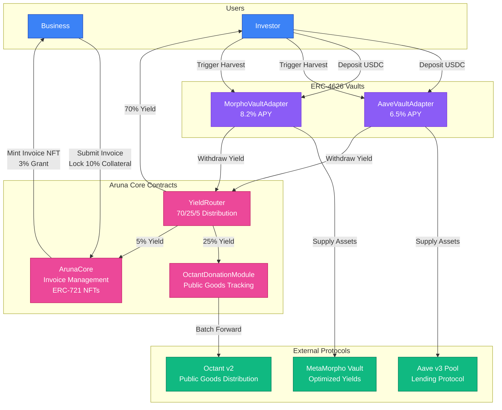
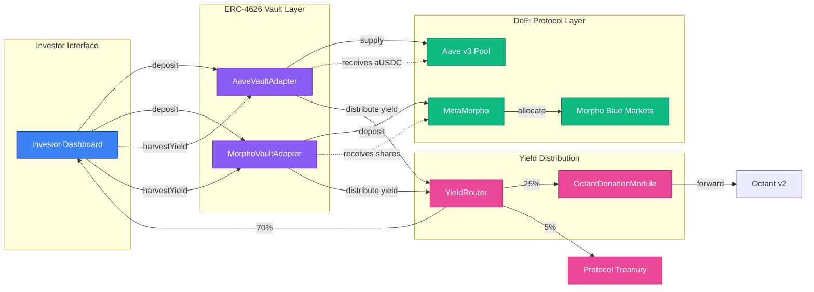
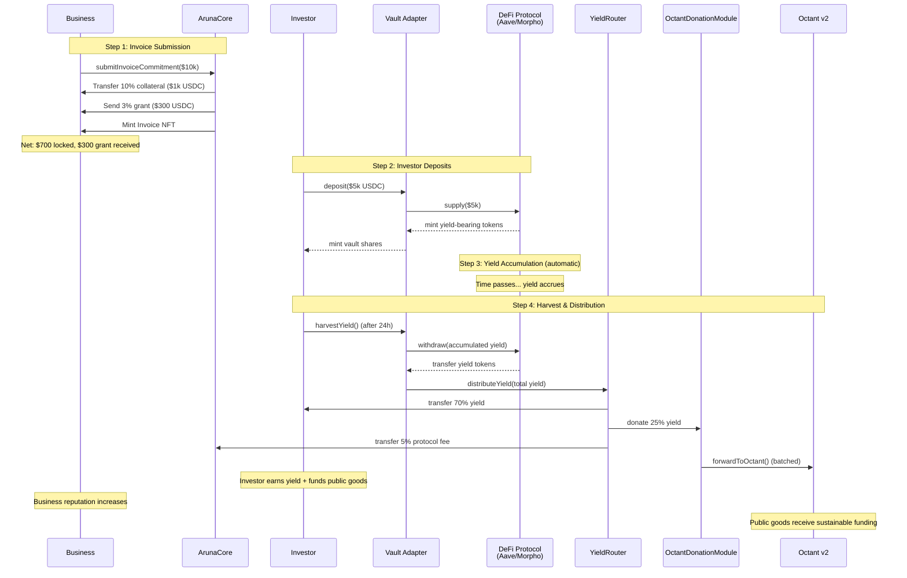

# Aruna

A decentralized invoice financing protocol that transforms business cash flow into sustainable public goods funding through automated yield distribution.

## Problem

Small and medium-sized businesses face chronic cash flow challenges due to delayed invoice payments, typically waiting 30-90 days for payment. Traditional invoice financing solutions are expensive, require extensive documentation, and provide no value beyond immediate liquidity.

Meanwhile, the Ethereum ecosystem struggles with sustainable public goods funding, relying on periodic grants and donations that are unpredictable and insufficient.

## Solution

Aruna connects these two problems into a single solution:

**For Businesses:**
- Submit invoice commitments and receive instant 3% grants
- Lock only 10% collateral (net 7% after grant)
- Build on-chain reputation through timely settlements
- Access working capital without traditional financing costs

**For Investors:**
- Deposit stablecoins into yield-generating vaults (Aave v3, Morpho)
- Earn competitive returns while supporting the Ethereum ecosystem
- Maintain full liquidity with no lock-up periods

**For Public Goods:**
- Receive 25% of all yield automatically
- Predictable, ongoing funding stream
- No grant applications required

### Yield Distribution Model

Every dollar of yield generated is distributed automatically:
- 70% to investors (competitive market returns)
- 25% to public goods via Octant v2
- 5% to protocol sustainability

## Key Features

### Invoice Financing
- Instant 3% grants on invoice submission
- 10% collateral requirement (7% net after grant)
- ERC-721 NFTs represent invoice commitments
- Reputation system rewards timely payment
- Automatic liquidation for defaults (120 days overdue)

### Dual Vault Strategy
- Aave v3 integration for stable 6.5% APY
- Morpho V2 integration for optimized 8.2% APY
- Both vaults are fully ERC-4626 compliant
- Users choose their preferred risk/return profile

### Automated Public Goods Funding
- Investor-triggered harvest distributes 25% of yield to Octant v2
- Harvest interval: once per 24 hours per vault
- Per-business contribution tracking
- Per-epoch donation aggregation
- Transparent on-chain events
- Supports Ethereum Foundation, Gitcoin, Protocol Guild, and more

### Security & Safety
- Non-custodial architecture
- ReentrancyGuard on all external functions
- SafeERC20 for all token operations
- Pausable contracts for emergencies
- Comprehensive input validation

## Architecture

The protocol consists of five primary smart contracts deployed on Base Sepolia:

**Core Contracts:**
- `ArunaCore.sol` - Main contract managing invoice commitments (ERC-721), grants, and reputation
- `YieldRouter.sol` - Distributes harvested yield according to 70/25/5 model
- `OctantDonationModule.sol` - Routes 25% of yield to Octant v2 for public goods allocation

**ERC-4626 Vault Adapters:**
- `AaveVaultAdapter.sol` - Wraps Aave v3 pools with automatic yield harvesting
- `MorphoVaultAdapter.sol` - Wraps Morpho MetaMorpho vaults with yield distribution

### System Architecture Diagram



### Vault Integration Architecture



### Complete User Journey Flow



**Key Flow:**
1. Investors deposit USDC to vault adapters → Vaults supply to Aave/Morpho
2. Yield accumulates automatically in underlying protocols
3. **Investor triggers `harvestYield()`** → Vaults withdraw yield
4. YieldRouter distributes: 70% investors, 25% public goods (OctantDonationModule), 5% protocol
5. Public goods data updates on-chain for transparency

## Technical Documentation

For detailed technical implementation:

- [Aave Integration](./AAVE.md) - Aave v3 vault implementation, interfaces, and safety checks
- [Morpho Integration](./MORPHO.md) - Morpho V2 MetaMorpho integration and architecture
- [Octant Integration](./OCTANT.md) - Public goods funding mechanism and distribution

## Technology Stack

**Smart Contracts:**
- Solidity 0.8.19
- Foundry for development and testing
- OpenZeppelin contracts for security standards
- Aave v3 Core for lending protocol integration
- Morpho Blue for optimized yield strategies

**Frontend:**
- Next.js 16 with App Router
- React 19
- TypeScript
- Tailwind CSS v4
- OnchainKit (Base) + Wagmi for Web3 connectivity
- Recharts for data visualization
- shadcn/ui components with Radix UI

**Network:**
- Base Sepolia (Testnet)
- Chain ID: 84532

**Deployed Contracts (Base Sepolia):**
- ArunaCore: `0xE60dcA6869F072413557769bDFd4e30ceFa6997f`
- AaveVaultAdapter: `0xCE62F26dCAc5Cfc9C1ac03888Dc6D4D1e2e47905`
- MorphoVaultAdapter: `0x16dea7eE228c0781938E6869c07ceb2EEA7bd564`
- YieldRouter: `0x124d8F59748860cdD851fB176c7630dD71016e89`
- OctantDonationModule: `0xEDc5CeE824215cbeEBC73e508558a955cdD75F00`

## Quick Start

### Smart Contracts

```bash
cd Aruna-Contract

# Install dependencies
forge install

# Configure environment
cp .env.example .env
# Edit .env with your configuration

# Compile contracts
forge build

# Run tests
forge test

# Deploy to Base Sepolia
forge script script/DeployAruna.s.sol \
  --rpc-url https://sepolia.base.org \
  --broadcast \
  --verify
```

### Frontend

```bash
cd Frontend

# Install dependencies
pnpm install

# Start development server
pnpm dev

# Build for production
pnpm build
```

## Configuration

### Required Environment Variables

**Smart Contracts (.env):**
```bash
PRIVATE_KEY=<your_deployer_private_key>
PROTOCOL_TREASURY=<treasury_address>
OWNER_ADDRESS=<owner_address>
METAMORPHO_VAULT=<metamorpho_vault_address>
BASESCAN_API_KEY=<basescan_api_key>
```

**Frontend (.env.local):**
```bash
NEXT_PUBLIC_BASE_SEPOLIA_RPC=https://sepolia.base.org
NEXT_PUBLIC_CHAIN_ID=84532
NEXT_PUBLIC_ONCHAINKIT_API_KEY=<your_onchainkit_api_key>

# Deployed Contract Addresses
NEXT_PUBLIC_ARUNA_CORE=0xE60dcA6869F072413557769bDFd4e30ceFa6997f
NEXT_PUBLIC_AAVE_VAULT=0xCE62F26dCAc5Cfc9C1ac03888Dc6D4D1e2e47905
NEXT_PUBLIC_MORPHO_VAULT=0x16dea7eE228c0781938E6869c07ceb2EEA7bd564
NEXT_PUBLIC_YIELD_ROUTER=0x124d8F59748860cdD851fB176c7630dD71016e89
NEXT_PUBLIC_OCTANT_MODULE=0xEDc5CeE824215cbeEBC73e508558a955cdD75F00
```

### Base Sepolia Addresses

The following addresses are hardcoded in the deployment script:
- USDC: `0x036CbD53842c5426634e7929541eC2318f3dCF7e`
- Aave v3 Pool: `0x07eA79F68B2B3df564D0A34F8e19D9B1e339814b`
- Aave aUSDC: `0x4e65fE4DbA92790696d040ac24Aa414708F5c0AB`

## Use Cases

### Web3 Development Agency
Monthly invoices of $50,000 with 60-day payment terms. Submits invoices to Aruna:
- Receives $1,500 instant grant (3%)
- Locks $5,000 collateral (10%, net $3,500 after grant)
- Builds on-chain credit history
- Markets as "Ethereum-aligned business"

### DeFi Investor
Deposits $100,000 USDC seeking yield with impact:
- Chooses between Aave (6.5% APY) or Morpho (8.2% APY)
- Triggers yield harvest (minimum 24-hour intervals per vault)
- Receives 70% of yield (5.46% effective APY on Morpho)
- Contributes 25% to Ethereum public goods via harvest trigger
- Maintains full liquidity, no lock-up

### Public Goods Project
Receives ongoing funding through Octant v2:
- Predictable revenue stream based on protocol TVL
- No grant applications required
- Transparent on-chain tracking
- Scales with protocol adoption

## Security Considerations

**Smart Contract Security:**
- All contracts audited for common vulnerabilities
- ReentrancyGuard protection on all state-changing functions
- SafeERC20 prevents silent token transfer failures
- Access control via OpenZeppelin Ownable
- Pausable functionality for emergency situations

**Risk Management:**
- 10% collateral ensures business commitment
- 120-day grace period before liquidation
- Reputation system incentivizes good behavior
- Emergency withdrawal functions for stuck funds

## License

MIT License

## Contributing

This project was built for the Octant DeFi Hackathon 2025. For questions or contributions, please open an issue or submit a pull request.

## Links

- Documentation: See AAVE.md, MORPHO.md, OCTANT.md
- GitHub: [Repository URL]
- Website: [Website URL]
- Twitter: [Twitter URL]
