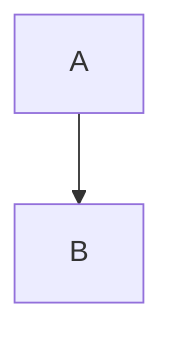

# Mermaid Diagrams - GitBook Cloud Setup

## Kenapa Mermaid Tidak Render?

GitBook Cloud memiliki 2 mode:
1. **GitBook Cloud** (gitbook.com) - Native support Mermaid ✅
2. **GitBook CLI** (legacy) - Perlu plugin ❌

## Solution: GitBook Cloud Setup

### Step 1: Import ke GitBook Cloud

**PENTING:** Jangan pakai GitBook CLI. Gunakan GitBook Cloud!

1. Go to https://www.gitbook.com
2. Sign in with GitHub
3. Click **"New Space"**
4. Select **"Import"** → **"GitHub"**
5. Choose repository: `yeheskieltame/Aruna`
6. Set source: **Root directory** (bukan `/docs`)
7. Click **"Import"**

### Step 2: Configure Space Settings

Setelah import:

1. Go to **Space Settings** (gear icon)
2. Click **"GitHub Sync"**
3. Set **"Monorepo root path"** ke: `docs`
4. Click **"Save"**

### Step 3: Enable Mermaid

GitBook Cloud automatically supports Mermaid, but verify:

1. Go to **Space Settings** → **"Integrations"**
2. Check if **"Mermaid"** is listed as supported
3. If yes, Mermaid should render automatically ✅

### Step 4: Verify Rendering

1. Open any page with Mermaid diagram
2. If still showing code:
   - Click **"Edit"** button
   - GitBook will re-process the markdown
   - Mermaid should render in live preview

## Alternative: Force Re-Import

If diagrams still not rendering:

1. Delete the current space
2. Re-import from GitHub
3. Make sure to set **monorepo path to `docs`**
4. Wait 1-2 minutes for processing

## Test Page

Create a simple test page to verify Mermaid works:

**test.md:**
```markdown
# Mermaid Test

This should render as diagram:


```

If this renders as a diagram, Mermaid is working! ✅

## Common Issues

### Issue 1: "Code block showing instead of diagram"

**Cause:** GitBook CLI being used instead of GitBook Cloud

**Fix:** Delete local GitBook CLI installation, use GitBook Cloud only

### Issue 2: "Diagram syntax error"

**Cause:** Complex Mermaid syntax not supported

**Fix:** Our diagrams already simplified, should work. If not, test each diagram at https://mermaid.live

### Issue 3: "Import failed"

**Cause:** Wrong repository path

**Fix:**
- Repository: `yeheskieltame/Aruna`
- Monorepo path: `docs`
- Branch: `main`

## Verification Checklist

- [ ] Using GitBook Cloud (not CLI)
- [ ] Imported from GitHub
- [ ] Monorepo path set to `docs`
- [ ] .gitbook.yaml exists in docs/
- [ ] SUMMARY.md detected
- [ ] Mermaid enabled in settings

## Still Not Working?

Try this simple diagram in GitBook editor directly:



If this works in editor but not from GitHub import:
1. Push changes to GitHub
2. In GitBook, click **"Sync with GitHub"** button
3. Wait for re-processing

## Contact GitBook Support

If nothing works:
- GitBook Support: support@gitbook.com
- Mention: "Mermaid diagrams not rendering from GitHub import"
- Send link to your repository

---

**Bottom line:** GitBook Cloud natively supports Mermaid. No plugins needed. Just import correctly with monorepo path set to `docs`.
