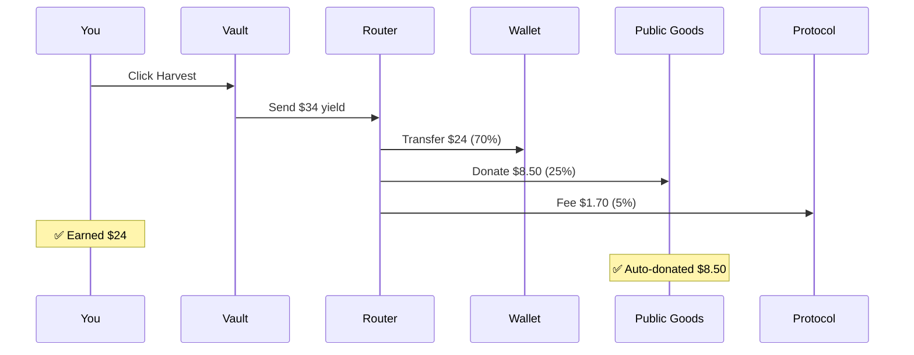
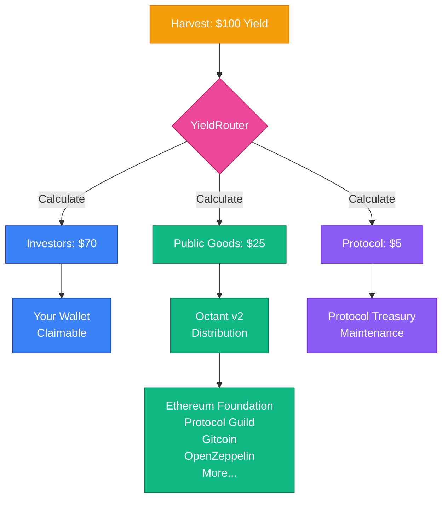

# How It Works

## For Investors (The Main Flow)

### Step 1: Connect & Deposit

1. **Visit Aruna App**
   - Connect your Web3 wallet (MetaMask, Coinbase Wallet, etc.)
   - Ensure you're on Base Sepolia network

2. **Choose Your Vault**
   - **Aave Vault**: 6.5% APY (stable, battle-tested)
   - **Morpho Vault**: 8.2% APY (optimized yields)

3. **Deposit USDC**
   - Enter amount (e.g., $5,000 USDC)
   - Approve transaction in wallet
   - Receive vault shares immediately

**What Happens Behind the Scenes:**
- Your USDC is deposited to Aave/Morpho
- You receive ERC-4626 vault shares
- Yield starts accruing automatically

---

### Step 2: Yield Accumulation (Automatic)

Your deposit earns yield every second:
- **Aave**: Interest accrues in aUSDC tokens
- **Morpho**: Share value increases automatically
- **No action needed**: Just wait

After 30 days on $5,000 deposit at 8.2% APY:
- **Yield earned**: ~$34
- **Your 70% share**: ~$24
- **Public goods (25%)**: ~$8.50
- **Protocol (5%)**: ~$1.70

---

### Step 3: Harvest Yield (Monthly)

Click the **"Harvest Yield"** button in investor dashboard:

**Requirements:**
- Must wait 24 hours between harvests
- Anyone can trigger (permissionless)
- Automatic 70/25/5 split

---

### Step 4: Claim Your Rewards

After harvest completes:
1. Navigate to "Claimable Rewards" section
2. Click "Claim" button
3. Approve transaction
4. USDC appears in your wallet

**You can also:**
- Withdraw principal anytime (no lock-up)
- Reinvest rewards to compound
- Continue earning indefinitely

---

## For Businesses

### Submit Invoice Commitment

1. **Navigate to Business Dashboard**
   - Connect wallet
   - Click "Submit New Invoice"

2. **Enter Invoice Details**
   - Customer name
   - Invoice amount (e.g., $10,000)
   - Due date (e.g., 90 days)

3. **Lock Collateral**
   - Approve 10% USDC transfer ($1,000)
   - Contract automatically sends 3% grant ($300)
   - Net: $700 locked, $300 earned instantly

4. **Receive Invoice NFT**
   - ERC-721 token representing your commitment
   - Can't be transferred until settled
   - Tracks in your dashboard

---

### Settle Invoice

When customer pays you:
1. Navigate to your pending invoices
2. Click "Settle" on paid invoice
3. Approve transaction
4. **Results:**
   - $700 collateral unlocked
   - +1 reputation point earned
   - NFT ownership maintained

---

## The 70/25/5 Distribution Explained

Every harvest triggers automatic distribution:

**This happens automatically. You can't skip it. No governance can change it.**

---

## Public Goods Tracking

The system tracks all donations transparently:

**Global Metrics:**
- Total donated to public goods (all-time)
- Current epoch donations
- Monthly donation trends

**Per-Business Attribution:**
- Each business can see their contribution
- Tracked by wallet address
- Visible in business dashboard

**Per-Epoch Tracking:**
- Donations grouped by Octant epochs
- Historical data preserved on-chain
- Auditable by anyone

---

## Key Features

### No Lock-up Period
- Withdraw principal anytime
- Only yield distribution has 24h interval
- Full liquidity maintained

### Permissionless Harvesting
- Anyone can call harvest function
- Gas paid by caller
- Rewards distributed to rightful owners

### On-Chain Verification
- Every transaction public
- Verify 70/25/5 split yourself
- Check donation history anytime

### Automatic Compounding (Optional)
- Reinvest claimed rewards
- Earn yield on yield
- Maximize returns over time

---

## Security Model

**Your Funds Are:**
- Held in battle-tested protocols (Aave v3, Morpho)
- Protected by ReentrancyGuard
- Withdrawable at any time
- Never custodied by Aruna directly

**Smart Contracts Are:**
- Verified on BaseScan
- Non-upgradeable (immutable)
- Pausable for emergencies only
- Open-source and auditable

---

## What's Next?

After understanding the flow:
1. Read [Key Concepts](concepts.md) for deeper understanding
2. Explore [Use Cases](use-cases.md) for real examples
3. Check [Smart Contracts](contracts.md) for addresses
4. Try the app on Base Sepolia testnet
