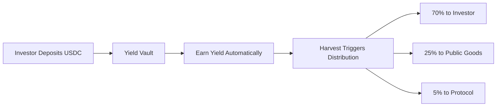

# The Solution

## Aruna's Innovation

Aruna removes the donation decision entirely. Instead of asking users to repeatedly choose to support public goods, we embed public goods funding into an activity they already want to do: **earning yield on stablecoins**.

### How It Works Simply

**One deposit → Perpetual public goods funding**

**[View Aruna Flow Diagram →](https://mermaid.live/edit#pako:eNqNVMtqwzAQ_JdC7hNlU6q0my4KhZKS0iWht1iWDYUWl4yEppIQv7tslNaWg_MnHuYQx5ar0iKVEhpRk_QDk6h6_wX-sHvlU_xCL7TG4Qf0A0-o-99J_rB95FP4Qi-0xtsuATb6Q16v0c-hSP4Tm8w4hLsoHfoA7pOb9AHdJ3eoA94DzbgfV_gYl6h7fQGY0DX6Q3GgK7TG4wBXac3mAK6Tm8wB3Sd3mAJ6Dq9wRzQdXqDJaDr9AZLQNfpDZaArtMbLAFdpzdYArpObwDANH8B5gBU)**

📊 Click to see diagram code

**One action. Perpetual impact.**

## Core Components

### 1. Invoice Financing (Business Side)

Businesses lock collateral against future invoice payments and receive instant grants:
- Submit $10,000 invoice commitment
- Lock $1,000 collateral (10%)
- Receive $300 instant grant (3%)
- **Net**: $700 locked, $300 earned immediately

This creates on-chain proof of creditworthiness and builds reputation through settlement history.

### 2. Yield Generation (Investor Side)

Investors deposit stablecoins to earn competitive yields:
- Deposit USDC to Aave v3 or Morpho vaults
- Earn 6.5-8.2% gross APY
- Maintain full liquidity (no lock-up)
- Withdraw anytime

### 3. Automatic Distribution

Every time yield is harvested, the split happens automatically:
- **70%** to investors (competitive returns)
- **25%** to public goods (via Octant v2)
- **5%** to protocol sustainability

This split is **immutable**. No governance can change it. No voting required.

## Key Innovations

### Passive Public Goods Funding

Traditional models:
- User deposits → earns yield → **decides** to donate → donates

Aruna model:
- User deposits → earns yield → **automatic** 25% to public goods

The donation happens as a natural consequence, not a separate decision.

### Predictable Revenue for Projects

Example: $10M TVL at 8.2% APY
- **Annual yield**: $820,000
- **To investors**: $574,000 (70%)
- **To public goods**: $205,000 (25%)
- **To protocol**: $41,000 (5%)

That's **$17,083 monthly** to public goods, automatically, regardless of market conditions or user sentiment.

### No Sacrifice Required

Investors still earn **5.74% effective APY** (70% of 8.2%), which is competitive with other DeFi yields. They're not sacrificing returns; they're earning well while supporting the ecosystem.

## Integration with Octant v2

Aruna routes the 25% allocation through Octant v2, which distributes to approved public goods:
- Ethereum Foundation
- Protocol Guild
- Gitcoin
- OpenZeppelin
- And more community-selected projects

This ensures funds go to legitimate, high-impact projects.

## Why This Scales

**At $1M TVL**: $20,500/year to public goods
**At $10M TVL**: $205,000/year to public goods
**At $50M TVL**: $1,025,000/year to public goods

Every new user automatically increases funding for the entire ecosystem. Growth is linear and predictable.

## Security & Transparency

All transactions are on-chain and verifiable:
- Every harvest creates a public transaction
- Exact amounts to each recipient are visible
- No central party can alter the split
- Users can verify their contributions anytime

This creates accountability that traditional donation systems lack.
