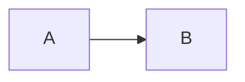
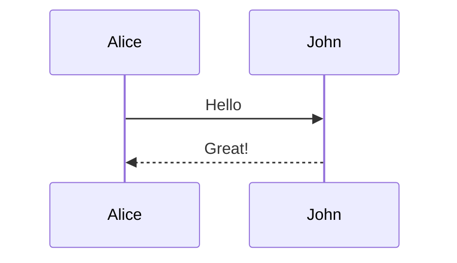
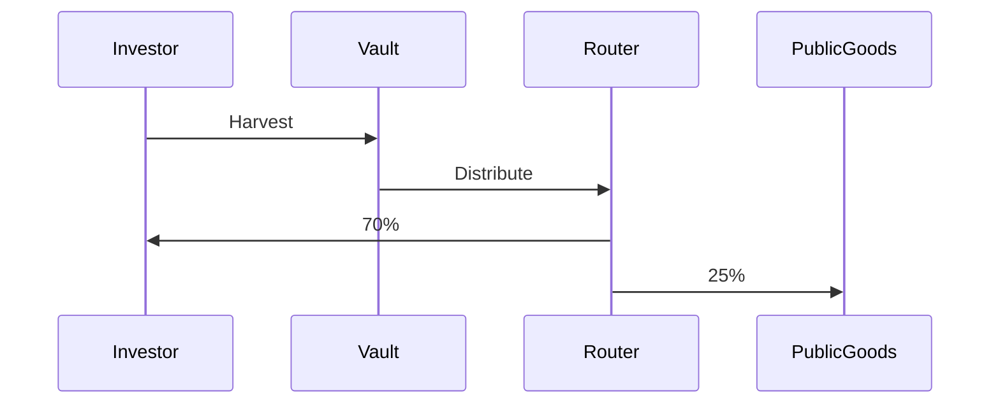

# Test Mermaid - Verification Page

## Test 1: Ultra Simple Diagram

Diagram paling sederhana:



**Expected:** Should show box A with arrow to box B

---

## Test 2: Simple Sequence



**Expected:** Should show sequence interaction

---

## Test 3: Your Actual Diagram (Simplified)



**Expected:** Should show harvest flow

---

## If ALL tests show code instead of diagrams:

**GitBook Cloud is NOT processing Mermaid.**

### Solution A: Use Mermaid Live Links

Instead of embedding, link to live preview:

[View Harvest Flow Diagram →](https://mermaid.live/edit#pako:eNpVjstqwzAQRX9lmFUDNl6kmy4KhZKS0kWhm2KYaCxZWPJDGpsQQv69smMaWg_MnHuZw4xar0iGVEhpBl_QDj6h6_wH-sHvkU_hCL7TGwRf0A0-o-v9J_rB75FP4Qi-0xtsuATb6Q16v0c-hSP4Tm8w4hLsoHfoA7pOb9AHdJ3eoA94DzbgfV_gYl6h7fQGY0DX6Q3GgK7TG4wBXac3mAK6Tm8wB3Sd3mAJ6Dq9wRzQdXqDJaDr9AZLQNfpDZaArtMbLAFdpzdYArpObwDANH8B5gBU)

### Solution B: Use Static Images

Convert Mermaid to PNG and commit to repo:

1. Go to https://mermaid.live
2. Paste your Mermaid code
3. Click "Download PNG"
4. Save to `/docs/images/`
5. Use ``

### Solution C: Use Simple Tables/Text

Replace diagrams with formatted text:

```
HARVEST FLOW:
━━━━━━━━━━━━━━━━━━━━━━━━
Investor → Harvest Yield → Vault
              ↓
         YieldRouter
         ┌────┼────┐
         ↓    ↓    ↓
       70%  25%  5%
         ↓    ↓    ↓
    Investor PG Protocol
```

---

## Diagnostic

After adding this page:

1. If **Test 1 shows diagram**: Mermaid works, your syntax is wrong
2. If **Test 1 shows code**: GitBook not processing Mermaid at all
3. If **nothing renders**: Page not detected by GitBook

Report which scenario you see!
