# Real-World Use Cases

## Use Case 1: Web3 Development Agency

**Scenario:** A blockchain development agency regularly invoices clients with 60-90 day payment terms.

### The Problem
- Monthly operating costs: $50,000
- Invoice payment delays: 60 days average
- Cash flow gaps create stress
- Can't take on new projects while waiting for payment

### Using Aruna

```mermaid
sequenceDiagram
    participant Agency as Web3 Agency
    participant Aruna as Aruna Protocol
    participant Client as Client

    Note over Agency: Invoice: $50,000<br/>Due: 60 days

    Agency->>Aruna: Submit invoice commitment
    Agency->>Aruna: Lock $5,000 collateral (10%)
    Aruna->>Agency: Send $1,500 grant (3%)

    Note over Agency: ✅ Net: $3,500 locked<br/>$1,500 grant received<br/>Cash flow improved!

    Note over Agency,Client: 60 days pass...

    Client->>Agency: Pay $50,000 invoice
    Agency->>Aruna: Settle invoice
    Aruna->>Agency: Unlock $3,500 collateral
    Aruna->>Agency: +1 reputation

    Note over Agency: Total benefit:<br/>$1,500 instant cash<br/>Built credit history<br/>No traditional fees
```

### Results
- **Immediate**: $1,500 working capital unlocked
- **Cost**: $3,500 locked for 60 days
- **ROI**: 43% on locked funds (over 60 days)
- **Long-term**: On-chain reputation built

---

## Use Case 2: Individual DeFi Investor

**Scenario:** An investor has $100,000 USDC seeking yield while supporting Ethereum ecosystem.

### The Journey

```mermaid
graph TB
    START[Investor has<br/>$100,000 USDC] -->|Research| COMPARE{Compare Options}

    COMPARE -->|Option A| TRAD[Traditional Staking<br/>4-5% APY<br/>❌ No public goods impact]
    COMPARE -->|Option B| ARUNA[Aruna Protocol<br/>5.46% effective APY<br/>✅ Auto-funds public goods]

    ARUNA --> DEPOSIT[Deposit to<br/>Morpho Vault]

    DEPOSIT --> MONTH1[After Month 1]
    MONTH1 --> HARVEST1[Harvest: $683 yield]
    HARVEST1 --> SPLIT1[Distribution:<br/>$478 earned<br/>$171 to public goods<br/>$34 to protocol]

    SPLIT1 --> MONTH2[After Month 2]
    MONTH2 --> HARVEST2[Harvest: $683 yield]
    HARVEST2 --> SPLIT2[Distribution:<br/>$478 earned<br/>$171 to public goods<br/>$34 to protocol]

    SPLIT2 --> YEAR1[After Year 1]

    YEAR1 --> RESULTS[Total Results:<br/>💰 $5,740 earned<br/>🌍 $2,050 to public goods<br/>📈 Reputation as supporter]

    classDef startClass fill:#3B82F6,stroke:#1E40AF,color:#fff
    classDef compareClass fill:#F59E0B,stroke:#D97706,color:#fff
    classDef arunaClass fill:#8B5CF6,stroke:#6D28D9,color:#fff
    classDef goodClass fill:#10B981,stroke:#047857,color:#fff
    classDef resultClass fill:#EC4899,stroke:#BE185D,color:#fff

    class START startClass
    class COMPARE compareClass
    class ARUNA,DEPOSIT arunaClass
    class MONTH1,MONTH2,HARVEST1,HARVEST2,SPLIT1,SPLIT2 goodClass
    class YEAR1,RESULTS resultClass
```

### Five-Year Impact

| Year | Investor Earnings | Public Goods Funded | Cumulative Impact |
|------|------------------|---------------------|-------------------|
| 1 | $5,740 | $2,050 | $2,050 |
| 2 | $5,740 | $2,050 | $4,100 |
| 3 | $5,740 | $2,050 | $6,150 |
| 4 | $5,740 | $2,050 | $8,200 |
| 5 | $5,740 | $2,050 | $10,250 |

**Total after 5 years:**
- Investor earned: $28,700
- Public goods funded: $10,250
- **From one deposit action**

---

## Use Case 3: DAO Treasury Management

**Scenario:** A DAO has $5M treasury seeking productive use while supporting ecosystem.

### Traditional Approach vs Aruna

```mermaid
graph LR
    subgraph Traditional["❌ Traditional Treasury Management"]
        T1[Treasury: $5M idle] --> T2[Options:<br/>• Staking: Low yields<br/>• Lending: No impact<br/>• Grants: One-time only]
        T2 --> T3[Result:<br/>Suboptimal returns<br/>No recurring impact]
    end

    subgraph Aruna["✅ Aruna Treasury Strategy"]
        A1[Treasury: $5M] --> A2[Deposit to Aruna Vaults]
        A2 --> A3[Outcomes:<br/>• $287K/year earned<br/>• $102K/year to public goods<br/>• Full liquidity maintained]
        A3 --> A4[Impact:<br/>✅ Competitive yields<br/>✅ Perpetual public goods funding<br/>✅ Aligned with values]
    end

    classDef traditionalClass fill:#EF4444,stroke:#DC2626,color:#fff
    classDef arunaClass fill:#10B981,stroke:#047857,color:#fff

    class T1,T2,T3 traditionalClass
    class A1,A2,A3,A4 arunaClass
```

### Annual Impact at $5M Deposit

**At 8.2% APY:**
- Total yield: $410,000
- DAO receives (70%): $287,000
- Public goods (25%): $102,500
- Protocol (5%): $20,500

**Compared to $100K Gitcoin donation:**
- Aruna funds **$102K every year** from yield alone
- DAO still earns $287K (competitive returns)
- Zero principal consumed
- Scales with treasury growth

---

## Use Case 4: Protocol-to-Protocol Integration

**Scenario:** A DeFi protocol wants to offer users public goods funding without complexity.

### Integration Flow

```mermaid
sequenceDiagram
    participant User as Protocol User
    participant Proto as Partner Protocol
    participant Aruna as Aruna Vaults
    participant PG as Public Goods

    User->>Proto: Deposit via partner UI
    Proto->>Aruna: Forward deposit to Aruna vault
    Aruna-->>Proto: Return vault shares
    Proto-->>User: Show balance + yield

    Note over Aruna: Yield accrues automatically

    User->>Proto: Request withdraw
    Proto->>Aruna: Harvest & withdraw
    Aruna->>Aruna: Distribute 70/25/5
    Aruna-->>Proto: Return user funds (70% yield)
    Aruna->>PG: Send 25% to public goods
    Proto-->>User: Transfer funds

    Note over User: ✅ Earned yield<br/>✅ Funded public goods<br/>✅ Seamless experience
```

### Benefits for Partner Protocol
- Differentiate with public goods impact
- No additional smart contract development
- Leverage Aruna's audited infrastructure
- Market as "impact-aligned" protocol

### Benefits for Users
- No workflow changes
- Automatic public goods support
- Competitive yields maintained
- Transparent impact tracking

---

## Use Case 5: Ethereum Core Developer Funding

**Scenario:** Protocol Guild receives funding from Aruna's 25% yield allocation.

### Funding Flow

```mermaid
graph TB
    subgraph Investors["💰 Aruna Investors"]
        I1[$2M deposited]
        I2[$5M deposited]
        I3[$3M deposited]
    end

    subgraph Vaults["🏦 Yield Generation"]
        V[Total: $10M TVL<br/>8.2% APY<br/>$820K/year yield]
    end

    subgraph Distribution["⚙️ Automatic Distribution"]
        D70[70% → $574K/year<br/>To Investors]
        D25[25% → $205K/year<br/>To Public Goods]
        D5[5% → $41K/year<br/>To Protocol]
    end

    subgraph Octant["🌍 Octant v2"]
        O[Distribute to:<br/>• Protocol Guild<br/>• Ethereum Foundation<br/>• Gitcoin<br/>• OpenZeppelin<br/>• More projects]
    end

    I1 & I2 & I3 --> V
    V --> D70 & D25 & D5
    D25 --> O

    O --> PG1[Protocol Guild:<br/>$50K/year<br/>Funds 10 core devs]
    O --> PG2[EF Research:<br/>$30K/year<br/>Supports EIP development]
    O --> PG3[Gitcoin Infrastructure:<br/>$25K/year<br/>Grant platform costs]
    O --> PG4[Other Projects:<br/>$100K/year<br/>Community-selected]

    classDef investorClass fill:#3B82F6,stroke:#1E40AF,color:#fff
    classDef vaultClass fill:#8B5CF6,stroke:#6D28D9,color:#fff
    classDef distClass fill:#F59E0B,stroke:#D97706,color:#fff
    classDef octantClass fill:#EC4899,stroke:#BE185D,color:#fff
    classDef pgClass fill:#10B981,stroke:#047857,color:#fff

    class I1,I2,I3 investorClass
    class V vaultClass
    class D70,D25,D5 distClass
    class O octantClass
    class PG1,PG2,PG3,PG4 pgClass
```

### Impact on Protocol Guild

**With $10M Aruna TVL:**
- Protocol Guild receives: ~$50,000/year
- Funds approximately: 10 part-time core developers
- Recurring: Every year, indefinitely
- Predictable: Can plan multi-year roadmaps

**As Aruna Grows to $100M TVL:**
- Protocol Guild receives: ~$500,000/year
- Funds approximately: 100 part-time developers
- Transforms ecosystem sustainability

---

## Use Case 6: Small Business Cash Flow

**Scenario:** A local blockchain consultancy with lumpy revenue.

### Monthly Cash Flow Comparison

**Without Aruna:**
- Month 1: Invoice $10K → Wait 60 days
- Month 2: Invoice $15K → Wait 60 days
- Cash crunch months 1-2
- Can't hire freelancer needed for project

**With Aruna:**
- Month 1: Invoice $10K → Lock $1K, get $300 grant → Hire freelancer
- Month 2: Invoice $15K → Lock $1.5K, get $450 grant → Cover expenses
- Month 3: First invoice paid → Unlock $700 collateral
- Smooth cash flow, business growth

### The Numbers

| Invoice | Collateral | Grant | Net Locked | Days | Effective APY |
|---------|-----------|-------|------------|------|---------------|
| $10,000 | $1,000 | $300 | $700 | 60 | 262% |
| $15,000 | $1,500 | $450 | $1,050 | 60 | 262% |
| $20,000 | $2,000 | $600 | $1,400 | 90 | 175% |

**Result:** Sustainable business growth with minimal capital requirements.

---

## Use Case 7: Yield Aggregator Integration

**Scenario:** Yield aggregator wants to offer "impact vaults" to users.

### User Experience

```mermaid
sequenceDiagram
    participant User
    participant Aggregator as Yield Aggregator
    participant Aruna as Aruna Vaults
    participant Display as User Dashboard

    User->>Aggregator: Browse vaults
    Aggregator-->>User: Show options:<br/>• Standard Vault: 6% APY<br/>• Impact Vault (Aruna): 5.46% APY + public goods

    User->>Aggregator: Select Impact Vault
    Aggregator->>Aruna: Deposit user funds
    Aruna-->>Aggregator: Return vault shares

    loop Monthly
        Aruna->>Aruna: Accrue yield
        User->>Aggregator: View dashboard
        Aggregator->>Aruna: Query yield earned
        Aggregator->>Display: Show:<br/>• Your earnings<br/>• Public goods funded<br/>• Total impact
    end

    Note over User,Display: ✅ Simple UX<br/>✅ Transparent impact<br/>✅ Competitive yields
```

### Aggregator Benefits
- Differentiate with impact-focused products
- Attract ESG-conscious users
- No additional smart contract risk
- Marketing advantage in competitive market

---

## Summary: Who Benefits?

| User Type | Primary Benefit | Secondary Benefit |
|-----------|----------------|-------------------|
| **Businesses** | Instant cash grants | On-chain credit history |
| **Investors** | Competitive yields | Automatic impact creation |
| **DAOs** | Treasury optimization | Values alignment |
| **Public Goods** | Sustainable funding | Predictable revenue |
| **Protocols** | User differentiation | Impact marketing |
| **Ecosystem** | Developer funding | Long-term sustainability |

---

## Getting Started

Ready to try Aruna? Here's what to do:

1. **For Investors**: Visit the investor dashboard, connect wallet, deposit USDC
2. **For Businesses**: Submit your first invoice commitment via business dashboard
3. **For Protocols**: Contact team about integration opportunities
4. **For Public Goods**: Apply to Octant v2 to receive allocations

**Questions?** Check out [How It Works](how-it-works.md) or review [Key Concepts](concepts.md).
